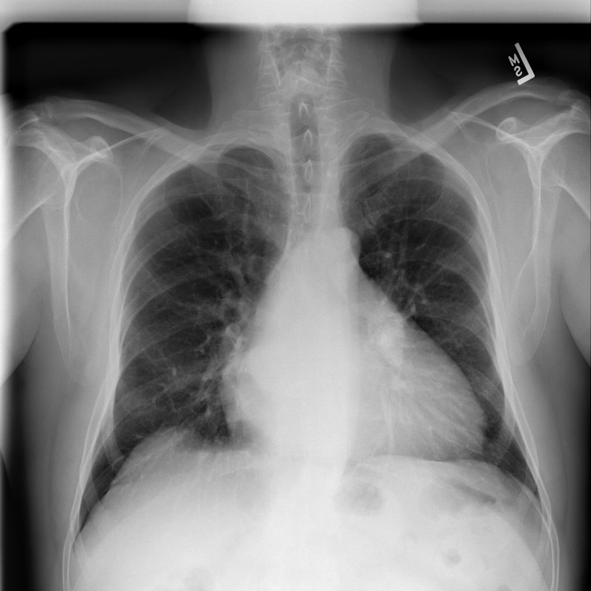

# Pneumonia X-Ray Classification

## Introduction
This repository contains code for classifying Pneumonia X-Ray images. 

## How to Use
To use this repository, please follow the steps below:

1. Set up a Python environment to ensure that you do not break your system. You can do this by running the following command:
    * If python3 is recognized as just python in your system then run:
        ```
        python -m venv env
        ```
    * Or if python3 is recognized as python3:
        ```
        python3 -m venv env
        ```

2. Activate the Python environment:
    * On Windows run:
        ```
        env\Scripts\activate
        ```
    * On Ubuntu run:
        ```
        env/bin/activate
        ```

3. Install Python dependencies by running the following command from the root directory of the repository:
    ```
    pip install -r requirements.txt
    ```

4. Run the following commands from the client folder:
    ```
    npm install
    npm run build
    ```

5. Start the server by running the following command:
    ```
    python server.py
    ``` 
